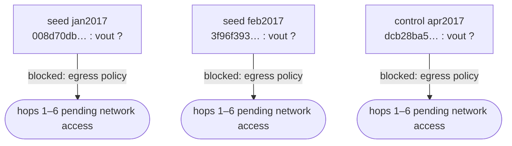

# Preliminary xCoins On-Chain Reconstruction

Status date: 2026-08-27. This report follows the agreed template. Sections
that depend on blockchain data record **why** they are empty rather than
speculating; per methodology, nothing here upgrades a heuristic or an
external claim into a fact.

## Seed validation

**Not yet performed — blocked by the analysis environment, not by the data.**

Every public blockchain explorer endpoint attempted (mempool.space,
blockstream.info/Esplora, blockchain.info/blockchain.com, Blockchair,
BTC.com, BlockCypher, SoChain, Bitaps, Blockonomics, blockexplorer.one,
btcscan.org, mempool.emzy.de) is denied with HTTP 403 at the environment's
egress proxy, and the environment's sanctioned WebFetch channel reports the
same domains as `EGRESS_BLOCKED`. Archival hosts needed for attribution
(web.archive.org, bitcointalk.org, reddit.com, trustpilot.com) are equally
blocked. Per proxy policy, denials were reported, not circumvented. Full
attempt log: `reports/crawl-log.md` and `raw/transactions/*.provenance.jsonl`.

Consequently the three seed claims below remain **UNVERIFIED** in both
directions — neither confirmed nor contradicted:

| seed | claimed txid (short) | claimed date | claimed amount | claimed destination |
|------|---------------------|--------------|----------------|--------------------|
| jan2017 (high) | `008d70db…5ba2e1` | 2017-01-06 | 0.05590700 BTC (~$49.76) | `1ATE8wW11ULvcksZYDnWf74SH5SKdXbAwo` |
| feb2017 (high) | `3f96f393…2b663d` | 2017-02-15 | 0.04912781 BTC (~$49.82) | `1LC7zdvLpQD3DZdE2eZdRnj7nMgiYActTk` |
| apr2017 (control) | `dcb28ba5…fa00da` | 2017-04-18 | 0.06359968 BTC (~$76.61) | `13kUu7RU9WF9UGQQoRM7QRbzTJaCFLfv6K` (note: "check") |

The validation code path (`scripts/fetch_tx.py --seeds`) is implemented and
will report exact-amount matches, candidate vouts, multi-output ambiguity,
and outspend status per output the moment it can reach an Esplora API.

## Jan 6 path

Not traceable yet. Intended notation once data exists:

```
008d70db… -> vout N (1ATE8wW…) -> TX2 -> ADDRESS -> TX3 …
```

## Feb 15 path

Not traceable yet (same blocker).

## April control path

Not traceable yet (same blocker). Per plan, this seed will be traced as a
control and not initially treated as xCoins.

## Intersections

None computable yet. `derived/intersections.json` is initialized empty;
`scripts/compare_paths.py` will populate it deterministically from the
traced paths.

## Wallet-pattern observations

No on-chain observations yet. External (non-chain) observations relevant to
what patterns to expect:

- Multiple independent grade-C retrospectives describe a **custodial lender
  wallet**: "deposit BTC into your xCoins bitcoin wallet" before matching;
  on the borrower's PayPal payment, "bitcoin is automatically transferred to
  the borrower's wallet". This is *consistent with* (not evidence of) a
  per-user deposit address → sweep → pooled custody → internal ledger
  architecture, and predicts one-time deposit addresses, rapid sweeps, and
  hot-wallet-like disbursement batching — all testable on-chain.

## External attribution evidence

- **Addresses**: verbatim searches for each of the three destination
  addresses returned **zero** public mentions. Negative result (weak — most
  explorer pages for arbitrary addresses are simply unindexed).
- **TXIDs**: verbatim searches for all three txids returned **zero** public
  mentions.
- **Service history** (graded per `evidence/sources.md`):
  - Custodial lender-wallet flow — grade C, multiple independent
    retrospectives.
  - 2017-era PayPal chargeback complaints from lenders, and first-party
    forum threads dedicated to chargeback support — grade D user claims on a
    grade-A first-party venue (`info.xcoins.io` forum, seen only via search
    snippets).
  - Shutdown: P2P marketplace disabled first; remaining services
    discontinued **2022-04-23** with a withdraw-your-funds-first
    instruction; company cited "developments beyond our control" — grade A
    via snippet only; verbatim capture pending Wayback access.
  - `info.xcoins.io` no longer resolves in DNS as of 2026-08-27; Trustpilot
    lists xcoins.io as "closed".

**No public source links any specific Bitcoin address or cluster to xCoins.**

## Evidence against xCoins attribution

- Nothing publicly ties the three destination addresses to xCoins; the only
  link is the user's own contemporaneous wallet records.
- The two high-priority deposits went to two different addresses; without
  the on-chain sweep analysis this is equally consistent with H1 (unrelated
  payments that happen to be ~$50).
- The April control's wallet note ("check") suggests the user themself was
  unsure of its nature.

## What is known

1. The user's wallet records claim the three sends above (source: user;
   plausible, unverified).
2. xCoins operated a custodial model for lender BTC (grade C, multiple
   sources) and shut down remaining services on 2022-04-23 after disabling
   the P2P marketplace (grade A via snippet).
3. 2017-era chargeback pressure on lenders is documented (grade D, multiple
   independent complainants; first-party support threads existed).
4. No public source mentions the three addresses or txids (negative result).
5. This environment cannot reach any public blockchain API (17 hosts, all
   403 at egress; logged).

## What is only inferred

- That the two ~$49.8 sends were xCoins deposits at all.
- That xCoins used one-time deposit addresses with sweeping — predicted by
  the custodial-model descriptions, but not yet observed.
- Any connection between the April control and the other two seeds.

## Highest-value next query

`GET /api/tx/{txid}` + `GET /api/tx/{txid}/outspends` for the two
high-priority seeds against any Esplora endpoint — four requests. They
simultaneously (a) validate or falsify both wallet-record claims and
(b) yield the exact first-hop spends, which is the single discriminator
between H1 (no common infrastructure) and H2 (sweeps into shared custody).

## Whether deeper crawl is justified

**Yes, but it is gated on network access, not on analytic judgment.** The
crawl plan (6 hops/seed, fan-out triage at >20 outputs, 500-tx cap,
convergence-first prioritization) is implemented in `scripts/trace_seed.py`
and `scripts/compare_paths.py`. Two ways to unblock:

1. Re-run this session/repo in an environment whose network policy allows
   `mempool.space` and/or `blockstream.info` (a custom Claude Code
   environment network policy naming those domains, or "allow all"), plus
   ideally `web.archive.org` for the attribution captures; or
2. Run the four scripts locally on any unrestricted machine — they cache
   everything under `raw/` with provenance, and committing that cache makes
   every later analysis step runnable offline from this repo.

## First–sixth hop graph

Placeholder — generated by `scripts/export_graph.py` once hops exist:


